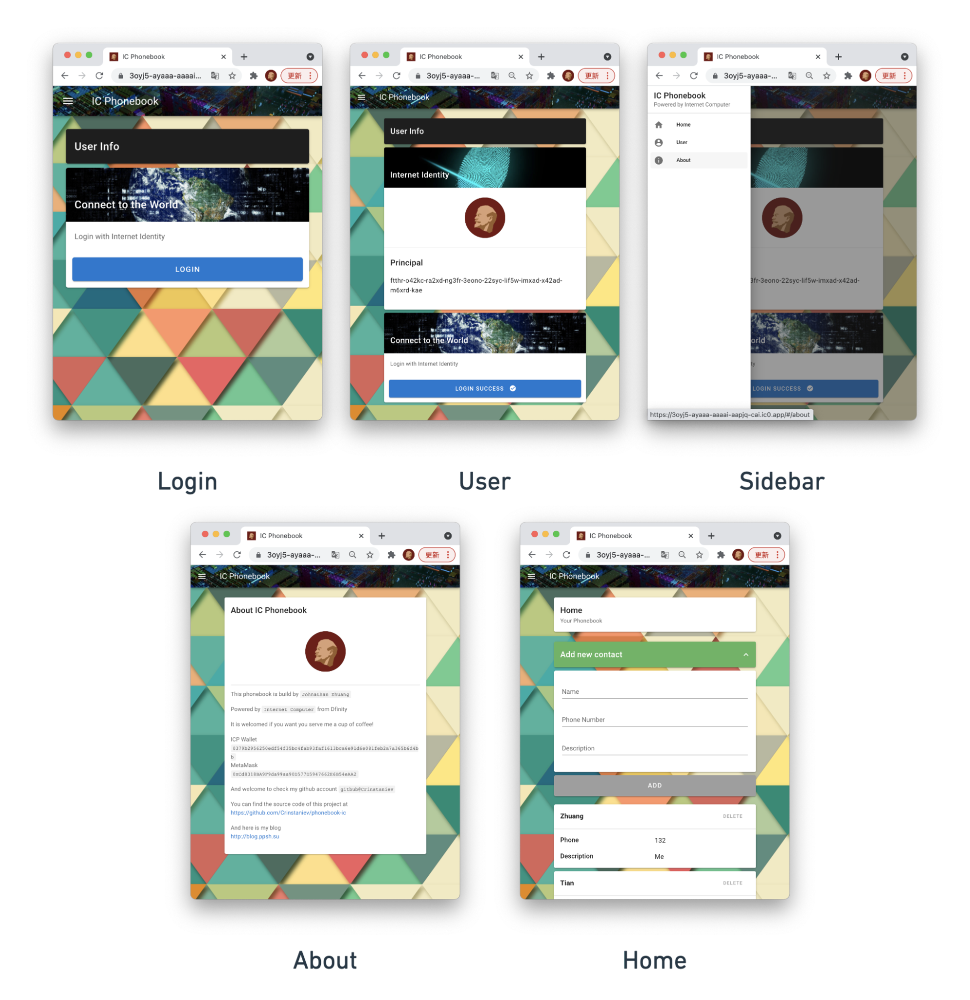
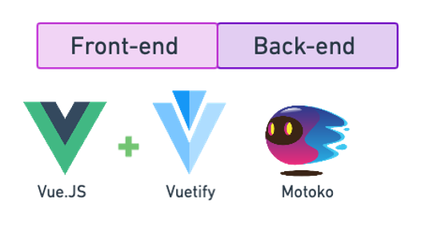
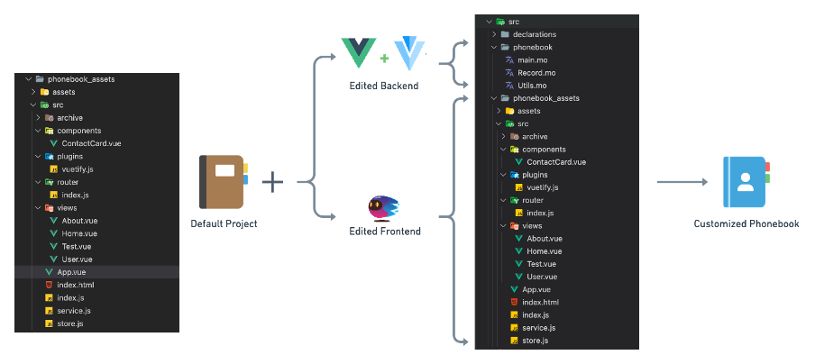
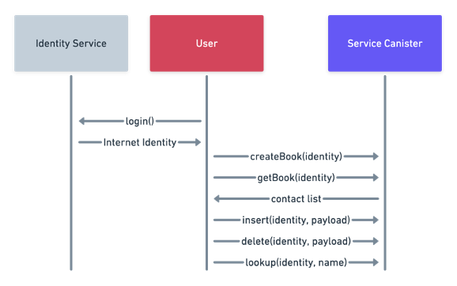
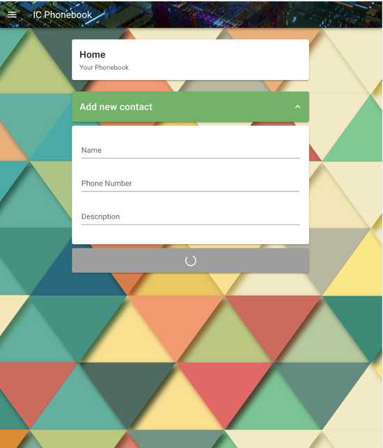

# Chapter 6 The Phonebook


<p align="center">
Chapter authors: Xinyu Tian and Zesen Zhuang
</p>

**Resources:**

GitHub Repository: [[URL](https://github.com/Crinstaniev/phonebook-ic)]

YouTube Documentary: [[URL](https://youtu.be/9YjRNba9O0s)]

<p align="center">
    <a href="https://www.youtube.com/watch?v=9YjRNba9O0s">
    
    </a>
    </br>
    YouTube Documentary
</p>

## I. Project Overview

We first demonstrate the functionality of the **Phonebook**. Our Phonebook serves as a DApp for contact information storage.

<p align="center">
  
  <br/>
  Figure 1: Pages
  <br/>
  [Source: <a href="https://whimsical.com/figure-1-3t884wZzZKeqPgoWHkHDC1">Created by Whimsical</a>]
</p>

Figure 1 demonstrates all the pages in the Phonebook DApp, and the functionalities include:

1.	A login page: Allows users to log in by [Internet Identity](https://dfinity.org/faq/internet-identity). The data between users with different identities are not shared.
2.	A user page: Allows users to view their Principal ID or to log out. 
3.	A sidebar: Allows users to jump between pages by clicking buttons.
4.	An about page: Provides some information about the developer of this DApp.
5.	A home page: Allows users to view previously stored contacts, add new contacts, or delete contacts.

## II. A step-by-step guide

### 1. Start the project

The most important thing to start the project is to understand and select the fittable technology stack. Usually, a web application consists of a front-end and a back-end. For the Phonebook, we will use [*Vue.JS*](https://vuejs.org/) and [*Vuetify*](https://vuetifyjs.com/) for the front-end architecture, and [*Motoko*](https://sdk.dfinity.org/docs/language-guide/motoko.html) programming language for the back-end. 

<p align="center">
  
  <br/>
  Figure 2: Tech Stack for the DApp Phonebook
  <br/>
  [Source: <a href="https://whimsical.com/figure-2-Lp5mHLXJGrvqBRSA12bGQd">Created by Whimsical</a>]
</p>

#### 1.1 Tech Stack - Front-end

The three essential parts of the Phonebook’s front-end developments are:

- Design of the user interface
- Design of user interaction logic
- Presentation of data

The front-end is to request data from the back-end and display it in a certain format to the user after the users’ operation. The front-end mostly uses the HTTP protocol API to communicate with the back-end.

Let’s take *Twitter* as an example: All the layouts and styles, including everything visible on Twitter, are parts of the front-end. And the back-end is in charge of the content of the tweets. After the back-end sends the tweets to the front-end in [*JSON*](https://en.wikipedia.org/wiki/JSON) format, the front-end renders the tweets and displays them on the browser.

Around a decade ago, developers used native *HTML + CSS + JavaScript* to write web pages, which has led to extremely inefficient development problems. Today, many off-the-shelf frameworks are available, allowing developers to write highly functional front-end interfaces with relatively simple code.

#### 1.2 Tech Stack - Back-end

The back-end serves as a content provider in a web application.  The back-end itself does not contain any visual elements. After receiving a request from the front-end, the back-end sends the corresponding data to the front-end in JSON format. 

Since we will be deploying this application on the Internet Computer, we will use the native Motoko language to program the back-end.

#### 1.3 Start Coding

*Note: Phonebook uses **dfx** version 0.8.1.*

Firstly, please make sure you’re using the same version to obtain identical results.

```sh
DFX_VERSION=0.8.1 sh -ci "$(curl -fsSL https://sdk.dfinity.org/install.sh)"
```

Next, create a new project using the **dfx** command.

```sh
dfx new phonebook && cd phonebook
```

After that, install the required package for the Phonebook.

```sh
npm install vue vue-loader vue-template-compiler style-loader css-loader sass sass-loader vuex vue-router vuetify file-loader @dfinity/principal @dfinity/candid @dfinity/identity @dfinity/authentication @dfinity/auth-client @dfinity/agent
```

<p align="center">
  
  <br/>
  Figure 3: File Structure
  <br/>
  [Source: <a href="https://whimsical.com/figure-3-31jFG4yopGEyvkh8YCmK7h">Created by Whimsical</a>]
</p>

The left-hand side of Figure 3 shows the file structure of the template folder automatically generated by **dfx**. The files and folders that need to be changed are:

1.	The **./phonebook/** folder, which contains back-end code.
2.	The **./phonebook_assets/** folder, which contains front-end code.
3.	The **./webpack.config.js** file, which includes compiler configuration. We need to change the configuration to make the compiler recognize Vue files. The completed version is available at: https://github.com/Crinstaniev/phonebook-ic/blob/master/webpack.config.js
4.	The **./dfx.json** file, which configures the entry point of the front-end. The modified version is available at: https://github.com/Crinstaniev/phonebook-ic/blob/master/dfx.json

### 2. Back-end Implementation

<p align="center">
  
  <br/>
  Figure 4: Functions of the Back-end
  <br/>
  [Source: <a href="https://whimsical.com/figure-4-Uf49a2KkbX5V3ixaDowFvZ">Created by Whimsical</a>]
</p>

Figure 4 shows the functions used in the back-end to communicate with the front-end. We will program the back-end based on this diagram.

The **./phonebook/** folder is the working directory for the back-end. The completed back-end code is available in the [phonebook](https://github.com/Crinstaniev/phonebook-ic/tree/master/src/phonebook) folder.

In main.mo, we define the following methods:

1.	The **getBook** method returns the whole phonebook of the current user.
2.	The **createBook** method is for new user registration. When it is called, the DApp will generate an empty phonebook for the current user.
3.	The **insert** method will add a new record in the current user’s phonebook.
4.	The **delete** method will remove a record from the current user’s phonebook.
5.	The **preupgrade** method is a [system method](https://sdk.dfinity.org/docs/language-guide/upgrades.html), which will store the phonebook objects into a persistent data structure (i.e. an array) to avoid data loss after upgrading the canister. 
6.	The **postupgrade** method is also a system method, which will be called after the canister upgrade is completed. It will convert the phonebook objects stored in the array into HashMap.

In **Record.mo**, we define a **Record** object which stores a single user’s phonebook. The **Record** object has the following methods:

1.	The **insert** method inserts a new record in the phonebook object.
2.	The **lookup** method will return the record with the given name.
3.	The **delete** method deletes a record.
4.	**getAll()**: This method returns all the records in this phonebook.
5.	**fromArray(arr)**: This method will construct a HashMap from an array that contains all the records of this phonebook.

In **Utils.mo**, we define a frequently used function: **signMsg(msg, code)**. This method constructs a JSON message which is used for returning error or success messages.

### 3. Front-end Implementation

After the back-end implementation, we program the front-end and then connect it to the back-end to finish the DApp.

You can find these files in the [phonebook_assets](https://github.com/Crinstaniev/phonebook-ic/tree/master/src/phonebook_assets) folder.

One thing to notice is that programming the front-end of the Phonebook requires a lot of knowledge about the [*Vue.JS*](https://vuejs.org/) framework so we won’t go into too many details here. This tutorial gives a brief overview of the functionality implemented in each file.

1.	The **./App.vue** file is the entry point of the Vue.JS framework. Here we define the overall layout of all the pages, including the sidebar and top bar, as well as the links between individual pages.
2.	The **./index.html** file is the entry point of the front-end. We mount the Vue app in the [\<body\>](https://developer.mozilla.org/en-US/docs/Web/HTML/Element/body) element.
3.	The **./service.js** file is the connector of the front-end and the back-end.
4.	The **./store.js** file is the configuration file for [Vuex](https://vuex.vuejs.org/). 
5.	The **./views/User.vue** file defines a page that displays user information. The User page also integrates the login function from the Internet Identity.
6.	The **./views/Home.vue** defines a page where users can add and delete contacts for their personal phonebooks.
7.	The **./views/About.vue** & **./views/Test.vue** files are for the about page and test page. Please ignore these two files.
8.	The **./router/** folder stores a configuration file for [Vue Router](https://router.vuejs.org/). The **./plugins/** folder stores a configuration file for **Vuetify**. 
9.	The **./components/ContactCard.vue** file defines a widget to render a contact entry.
10.	The **./archive/** folder stores some old version files. Please ignore this folder.

### 4. Integration of Front-end and Back-end

With the efforts of [Dfinity](https://dfinity.org/) engineers, connecting the front-end to the back-end has become extremely easy. As mentioned earlier in this tutorial, the **./service.js** file defines a front-end and back-end connector. We’ll go through the details.

```javascript
import { canisterId, createActor } from '../../declarations/phonebook';
import { AuthClient } from '@dfinity/auth-client';

export const getActor = async identity => {
  const actor = createActor(canisterId, {
    agentOptions: {
      identity
    }
  });
  return actor;
};

export const getAuthClient = async () => {
  return await AuthClient.create();
};
```

Two methods are defined in the **./service.js** file: the **getActor** method that serves as a connector to the back-end and the **getAuthClient** method that allows communication to the Internet Identity service.

Here we provide a sample usage of the getActor method. An agent of the back-end can be initiated by:

```js
const actorAgent = await getActor()
```

Functions defined in the back-end can be accessed by asynchronously calling the agent:

```js
const result = await actorAgent.getBook()
```

### 5. Troubleshooting

When the version of **dfx** bumps, problems may occur in the communication between the front-end and the back-end. The Phonebook DApp was deployed using **dfx** version 0.8.0 and tested again when the **dfx** version bumped to 0.8.1. However, while the user tried to add a new contact, the DApp refused to respond. And the users were not able to check the existing contacts, but the login util was still working. As shown in figure 5, the button stayed in loading when the user tried to add a new contact:

<p align="center">
  
  <br/>
  Figure 5: Trouble-shooting
</p>

For troubleshooting, we called the back-end canister by executing the command in the terminal:

```sh
dfx canister --network=ic call phonebook getBook
```

However, the back-end canister did not respond to the direct call. After trials, we found that the problem could be resolved by upgrading the **dfx**. You can upgrade the **dfx** by executing the following command:

```sh
dfx upgrade
```

After upgrading, delete the **./canister_ids.json** file to reset the canisters. If you have Cycles in your [cycles wallet](https://github.com/dfinity/cycles-wallet), you can conveniently create and deploy new canisters by executing the following command: 

```sh
dfx deploy --network=ic
```

But if you don’t have a valid cycles wallet, you can create the canisters in [NNS](https://nns.ic0.app/) and re-create the **./canister_ids.json** file.

Finally, execute the following command to re-deploy the Phonebook DApp:

```sh
dfx deploy --network=ic --no-wallet
```

In most situations, the Phonebook DApp will be back to work.

## Conclusion

Congratulations! Now you have completed deploying your DApp Phonebook on the Internet Computer. In this tutorial, we introduce how to deploy a fully functional DApp, Phonebook, to the Internet Computer. Firstly, we sketch the creation and configuration of the project, then we explain in detail the functionality and composition of the back-end as well as the front-end. After that, we elaborate steps of connecting the front-end to the back-end using agents. Finally, we do troubleshooting to analyze and solve the problem caused by the **dfx** version.
